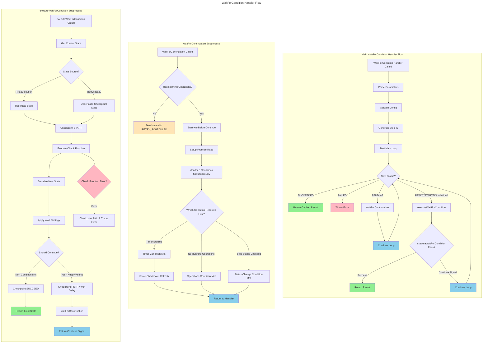

# WaitForCondition Handler Flowchart

## WaitForCondition Detailed Logic

The waitForCondition handler now implements the same main loop pattern as the step handler:

**1. Main Loop Pattern**:

- **while (true)** loop that re-evaluates step status after waiting
- **CONTINUE_MAIN_LOOP** symbol for flow control between executeWaitForCondition and main loop
- Enables proper handling of concurrent operations during retries

**2. Status-Based Flow**:

- **SUCCEEDED**: Returns cached final state
- **FAILED**: Throws error from previous attempt
- **PENDING**: Waits for scheduled retry using waitForContinuation, then continues loop
- **READY/STARTED/undefined**: Executes check function

**3. State Management**:

- **First Execution**: Uses `config.initialState`
- **Retry/Ready**: Deserializes state from previous checkpoint
- **State Evolution**: Check function transforms current state to new state

**4. Wait Strategy Decision**:

- Calls `config.waitStrategy(newState, attemptNumber)`
- Returns `{ shouldContinue: boolean, delay?: Duration }`
- **shouldContinue = false**: Condition met, complete successfully
- **shouldContinue = true**: Schedule retry with delay, return CONTINUE_MAIN_LOOP

**5. Concurrent Operations Support**:

- Uses same `waitForContinuation` logic as step handler
- Checks `hasRunningOperations()` before terminating
- Monitors timer, operations, and status changes simultaneously
- **Main Loop Re-evaluation**: After waitForContinuation, continues loop to re-check status

## Key Similarities with Step Handler

**Main Loop Pattern**:

- Both use `while (true)` loop for re-evaluation
- Both use `CONTINUE_MAIN_LOOP` symbol for flow control
- Both handle PENDING status with waitForContinuation → continue

**Concurrent Operations**:

- Identical `waitForContinuation` implementation
- Same Promise.race monitoring of timer/operations/status
- Same prevention of premature termination

**Flow Control**:

- Both can return to main loop after waiting
- Both re-evaluate step status after waitForContinuation
- Both handle race conditions in concurrent execution scenarios
